# Stage 14 — Automation Testing Deep Dive

> **Goal:** build real, maintainable UI + API automation from scratch — language basics, tool choice, the Page Object Model, locators & waits that don't flake, data-driven design, CI/CD, and reporting. [Stage 8](09-path-to-automation.md) told you *when* to automate and *why*; this chapter is the *how*, hands-on. I run Playwright suites in production for client platforms and built the MyGP backend framework from zero — this is the distilled version.

## 1. The mindset: automation is software

Your test suite is a codebase your team depends on. Flaky, unreadable tests are worse than no tests — they erode trust until people ignore red builds. Treat automation with the same care as production code: version control, code review, naming, DRY, and ruthless flakiness control.

## 2. The test automation pyramid



- **Unit (base, most):** fast, developer-owned, test one function. Milliseconds.
- **Integration / API (middle):** test how pieces talk — your sweet spot as QA. Seconds. Stable, high value. See [Stage 12](13-api-testing-deep-dive.md).
- **E2E / UI (top, fewest):** test whole user journeys through the browser. Slow, valuable, flaky if overused. **Automate only your critical paths here** — the rest lives in manual/exploratory.

**The #1 automation mistake:** an inverted pyramid — hundreds of slow, brittle UI tests and almost no API/unit coverage. Push tests *down* the pyramid whenever the same logic can be verified at a lower level.

## 3. Pick one language and stick with it

You need far less programming than you fear: variables, functions, loops, conditionals, arrays/objects, and async/await. Choose based on your stack and job market:

| Language | Pairs with | Learn from |
|---|---|---|
| **JavaScript / TypeScript** | Playwright, Cypress | [freeCodeCamp JS](https://www.freecodecamp.org/learn), [TS docs](https://www.typescriptlang.org/docs/) |
| **Python** | Playwright, Selenium, pytest | [Python for Everybody](https://www.py4e.com/) |
| **Java** | Selenium, REST Assured | job-market heavy in enterprise |

My recommendation for a manual tester starting today: **TypeScript + Playwright**. Modern, less boilerplate, auto-waiting kills most flakiness, and it's where the industry is moving.

## 4. Tool landscape (2026)

| Tool | Best for | Notes |
|---|---|---|
| **[Playwright](https://playwright.dev/)** | Modern web E2E | Auto-wait, multi-browser (Chromium/Firefox/WebKit), trace viewer, codegen, parallel by default. My default. |
| **[Cypress](https://www.cypress.io/)** | Component + E2E, great DX | Time-travel debugger; historically Chromium-focused |
| **[Selenium](https://www.selenium.dev/)** | Broadest language/browser support | The veteran; still everywhere in job listings — know the concepts |
| **[Appium](https://appium.io/)** | Mobile (iOS/Android) | Selenium-family for apps |
| **[REST Assured](https://rest-assured.io/)** / Postman+Newman | API automation | Pair with the [API chapter](13-api-testing-deep-dive.md) |
| **AI-assisted** | Agentic test authoring & self-healing | Playwright MCP — see [Stage 11](12-ai-for-qa.md) |

## 5. Anatomy of a Playwright test

```typescript
import { test, expect } from '@playwright/test';

test('member checks out with a valid card', async ({ page }) => {
  await page.goto('/login');
  await page.getByLabel('Email').fill('qa-member-04@example.com');
  await page.getByLabel('Password').fill(process.env.TEST_PW!);
  await page.getByRole('button', { name: 'Sign in' }).click();

  await page.getByRole('link', { name: 'Cart' }).click();
  await page.getByRole('button', { name: 'Checkout' }).click();
  await page.getByRole('button', { name: 'Pay' }).click();

  await expect(page.getByText(/order confirmed/i)).toBeVisible();
  await expect(page).toHaveURL(/\/order\/\d+/);
});
```

Notice: **role- and label-based locators**, not brittle CSS/XPath. Playwright auto-waits for elements — no manual sleeps.

## 6. Locators & waits — where flakiness lives and dies

**Locator priority (most to least robust):**
1. Accessible role + name: `getByRole('button', {name: 'Pay'})`
2. Label / placeholder / text: `getByLabel`, `getByText`
3. Test IDs: `getByTestId('checkout-pay')` — ask devs to add `data-testid`
4. CSS — only when nothing better exists
5. ❌ XPath by position (`//div[3]/span[2]`) — breaks on any layout change

**Waiting — the golden rule: never `sleep()`.**
- ❌ `await page.waitForTimeout(3000)` — either too slow or too flaky
- ✅ Wait for a *condition*: element visible, network idle, URL changed, response received. Playwright/Cypress do this automatically via web-first assertions.

## 7. The Page Object Model (POM)

Separate *what a page can do* from *what a test checks*. When the UI changes, you fix one file, not fifty tests.

```typescript
// pages/CheckoutPage.ts
export class CheckoutPage {
  constructor(private page: Page) {}
  pay = () => this.page.getByRole('button', { name: 'Pay' }).click();
  confirmation = () => this.page.getByText(/order confirmed/i);
}

// test
const checkout = new CheckoutPage(page);
await checkout.pay();
await expect(checkout.confirmation()).toBeVisible();
```

Keep **assertions in tests**, **actions in page objects**. Add fixtures/factories for reusable setup (logged-in state, seeded data).

## 8. Data-driven testing

Run the same test across many inputs — your [EP/BVA](02-test-design-techniques.md) tables become a data table:

```typescript
const cases = [
  { card: '4242424242424242', expect: 'confirmed' },
  { card: '4000000000000002', expect: 'declined' },
  { card: '4000000000000069', expect: 'expired'  },
];
for (const c of cases) {
  test(`checkout with ${c.card} → ${c.expect}`, async ({ page }) => { /* ... */ });
}
```

## 9. CI/CD — tests that run themselves

Automation nobody runs is theater. Wire it into GitHub Actions so it runs on every push/PR:

```yaml
name: e2e
on: [push, pull_request]
jobs:
  test:
    runs-on: ubuntu-latest
    steps:
      - uses: actions/checkout@v4
      - uses: actions/setup-node@v4
        with: { node-version: 20 }
      - run: npm ci
      - run: npx playwright install --with-deps
      - run: npx playwright test
      - uses: actions/upload-artifact@v4
        if: always()
        with: { name: playwright-report, path: playwright-report/ }
```

"My tests run automatically on every PR and block merges on failure" is a career-defining sentence in interviews.

## 10. Reporting & debugging

- **Playwright Trace Viewer** — a full timeline with DOM snapshots, network, and console for every step. The single best debugging tool in web automation.
- **Allure** / built-in HTML reporter — shareable results with screenshots + videos on failure. Configure `screenshot: 'only-on-failure'` and `trace: 'on-first-retry'`.
- **Retries + quarantine** — set 1–2 retries for known-flaky externalities, but *investigate* every retry; a suite that only passes on retry is lying to you.

## 11. Framework architecture (what "senior" looks like)

```
tests/            # specs — readable, assertion-focused
pages/            # page objects — actions & locators
fixtures/         # auth state, test users, seeded data
utils/            # api helpers, data generators
data/             # test data files (json/csv)
playwright.config # envs, projects (browsers), reporters, retries
.github/workflows # CI
```

Principles: **independent tests** (any order, no shared state), **fresh data per run** (create + clean up), **env-driven config** (no hardcoded URLs/creds), **parallel-safe**.

## 12. The flakiness checklist

When a test flakes, it's almost always one of these:
- [ ] A hard sleep instead of a condition wait
- [ ] A race on data (another test/user changed shared state — isolate it)
- [ ] Animation/transition not settled (wait for the end state, not a timer)
- [ ] Locator matching two elements (tighten it)
- [ ] Network timing (mock it, or wait for the response)
- [ ] Test order dependence (make each test self-contained)

## 13. Your first automation portfolio project

Automate the top 8–10 regression cases from your [manual portfolio](07-career-journey.md) against [saucedemo.com](https://www.saucedemo.com/):
1. Playwright + TypeScript, POM structure, data-driven where it fits
2. Running in GitHub Actions on every push, with the HTML report uploaded as an artifact
3. A README explaining *what you automated and why* (and what you deliberately left manual)

That repo — real, running, green — beats any certificate.

## ✅ Exercise

1. Install Playwright (`npm init playwright@latest`), run `npx playwright codegen saucedemo.com`, and record a login — then **rewrite** the generated test with role-based locators and a page object
2. Add a data-driven login test: valid, locked-out, and wrong-password users
3. Push it to GitHub with the Actions workflow above and watch it run green

**Next →** [Stage 15: Performance Testing](16-performance-testing.md)
