# Stage 15 — Performance Testing Deep Dive

> **Goal:** answer "will it hold up under real load?" with evidence. Learn the test types, the metrics that matter, a repeatable methodology, and the tools (k6, JMeter, Gatling, Locust) — plus how to read results and find bottlenecks. I've load-tested payment-critical systems at Mastercard and telecom-scale traffic at Grameenphone, and shipped a [k6 suite for FUR4](https://github.com/azaworld/Fur4-Load-Testing-K6); this is the field-tested version.

## 1. Why performance testing is its own discipline

Functional testing asks *"does it work for one user?"* Performance testing asks *"does it still work for 10,000 — and how does it fail when it finally does?"* A feature that's correct but takes 12 seconds under load is a broken feature. Slow is the new down.

## 2. The types of performance testing



| Type | Question it answers | Load profile |
|---|---|---|
| **Load** | Does it meet targets at *expected* peak? | Ramp to expected peak, hold, observe |
| **Stress** | Where does it *break*, and how gracefully? | Ramp past capacity until it fails |
| **Spike** | Can it survive a *sudden* surge (flash sale, viral post)? | Instant jump to high load, then drop |
| **Soak / Endurance** | Does it degrade over *time* (memory leaks, connection exhaustion)? | Moderate load held for hours |
| **Scalability** | Does adding resources actually help? | Increase load + resources, measure gain |
| **Volume** | Does it handle large *data* (huge tables, big payloads)? | Big datasets, not just many users |

## 3. The metrics that actually matter

**Never report averages alone — averages hide the pain.** Use percentiles.

| Metric | What it means | Why it matters |
|---|---|---|
| **Latency (response time)** | Time per request | Report **p50 / p95 / p99**, not just mean. p95 = "95% of users saw this or better" |
| **Throughput** | Requests/sec (RPS) or transactions/sec | The system's actual capacity |
| **Error rate** | % of failed requests under load | A fast system that 500s at scale has failed |
| **Concurrency / VUs** | Virtual users active at once | The load level you're simulating |
| **Saturation** | CPU, memory, DB connections, I/O | *Where* the bottleneck is (needs server monitoring) |

> **The percentile trap:** an average of 200ms can hide a p99 of 8s — meaning 1 in 100 requests is agony. At scale, p99 *is* someone's every experience. Always look at the tail.

## 4. A repeatable methodology

1. **Define goals in numbers.** "p95 < 500ms and error rate < 1% at 2,000 concurrent users." Vague goals = useless tests. Get these from product/SLAs.
2. **Model realistic load.** Real users don't hammer one endpoint — they follow journeys with think-time (pauses). Base your mix on real analytics.
3. **Use a production-like environment.** Testing on a laptop tells you nothing. Match prod topology, data volume, and config as closely as possible.
4. **Baseline first.** Measure at low load so you can see what degrades.
5. **Ramp gradually,** watch metrics live, and note the load level where latency/errors start climbing — that's your **knee**.
6. **Monitor the server, not just the client.** The load tool shows symptoms (slow responses); server metrics (CPU, memory, DB) show the *cause*.
7. **Analyze & isolate the bottleneck,** retest after each fix. One variable at a time.
8. **Report** with percentiles, graphs, the breaking point, and a clear verdict.

## 5. The tools

| Tool | Language / style | Best for |
|---|---|---|
| **[k6](https://k6.io/)** | JavaScript scripts, CLI-first | Modern, developer-friendly, CI-native. **My default** — see my [FUR4 k6 suite](https://github.com/azaworld/Fur4-Load-Testing-K6) |
| **[JMeter](https://jmeter.apache.org/)** | GUI + XML | The veteran; huge protocol support, big ecosystem, common in job listings |
| **[Gatling](https://gatling.io/)** | Scala/Java DSL | High performance, great HTML reports |
| **[Locust](https://locust.io/)** | Python | Pythonic, easy to script complex user behavior |
| **[Artillery](https://www.artillery.io/)** | YAML/JS | Simple, cloud + serverless friendly |

### A k6 test looks like this

```javascript
import http from 'k6/http';
import { check, sleep } from 'k6';

export const options = {
  stages: [
    { duration: '2m', target: 200 },   // ramp up to 200 VUs
    { duration: '5m', target: 200 },   // hold (this is the "load" phase)
    { duration: '2m', target: 0 },     // ramp down
  ],
  thresholds: {
    http_req_duration: ['p(95)<500'],  // 95% under 500ms — fail the build otherwise
    http_req_failed:   ['rate<0.01'],  // <1% errors
  },
};

export default function () {
  const res = http.get('https://staging.example.com/api/products');
  check(res, { 'status 200': (r) => r.status === 200 });
  sleep(1);   // think-time — model real users, don't hammer
}
```

Run: `k6 run script.js`. Those **thresholds** turn a load test into a pass/fail gate you can drop into CI.

## 6. Reading results & finding bottlenecks

Where the problem usually hides, in rough order of frequency:
- **Database** — missing indexes, N+1 queries, connection-pool exhaustion, lock contention (the #1 culprit)
- **Application** — inefficient code, synchronous blocking calls, no caching
- **Network / payload** — huge responses, chatty APIs, no compression
- **Infrastructure** — undersized instances, no autoscaling, single points of failure
- **Third parties** — a slow payment or shipping API dragging your p99

Pair the load tool with observability — **Grafana + Prometheus/InfluxDB** dashboards (k6 streams to these natively) — so you watch latency, throughput, and server saturation on one screen while the test runs.

## 7. Performance in CI/CD

Bake a lightweight load test (a few minutes, modest VUs) into your pipeline with thresholds, so a performance regression fails the build the same way a functional bug does. Run the heavy, long-duration soak/stress tests on a schedule (nightly/weekly) against a prod-like environment.

## 8. Reliability & chaos (the advanced edge)

Beyond load: **chaos engineering** — deliberately inject failures (kill a node, add network latency, saturate CPU) to verify the system degrades gracefully and recovers. I ran this on payment-critical systems at Mastercard, where the tolerance for silent failure was effectively zero. Tools: [Chaos Mesh](https://chaos-mesh.org/), Gremlin, or simple fault injection via a proxy ([Stage 5](06-tools.md)). It pairs naturally with soak testing.

## 9. Learn it (free, hands-on)

| Resource | What it gives |
|---|---|
| [k6 documentation](https://grafana.com/docs/k6/latest/) | Excellent official docs + examples — start here |
| [Grafana k6 Learn](https://grafana.com/docs/k6/latest/examples/) | Ready-to-run test recipes |
| [JMeter User Manual](https://jmeter.apache.org/usermanual/index.html) | The canonical JMeter reference |
| [my FUR4 k6 suite](https://github.com/azaworld/Fur4-Load-Testing-K6) | A real load-testing suite you can read |
| Practice targets | [k6 test.k6.io](https://test.k6.io/), [restful-booker](https://restful-booker.herokuapp.com/) — safe to load-test |

> ⚠️ **Ethics:** only load-test systems you own or are authorized to test. Hammering a site you don't control is an attack, not a test.

## 10. Portfolio project

A k6 (or JMeter) suite against a public test API:
1. Load, stress, and spike scenarios with realistic think-time and a journey mix
2. Thresholds that pass/fail the run, wired into GitHub Actions
3. A short report: percentile latencies, throughput, the breaking point, and one bottleneck hypothesis with evidence

## ✅ Exercise

Using k6 against [test.k6.io](https://test.k6.io/):
1. Write a load test: ramp to 50 VUs, hold 3 min, with a p95 < 800ms threshold and think-time
2. Turn it into a spike test (jump straight to 300 VUs) — does the error rate climb? At what point?
3. Report p50/p95/p99, throughput, and error rate — and state whether it passed your goal and why

**Next →** revisit [the full roadmap](README.md) or the [Sources library](11-resources.md)
