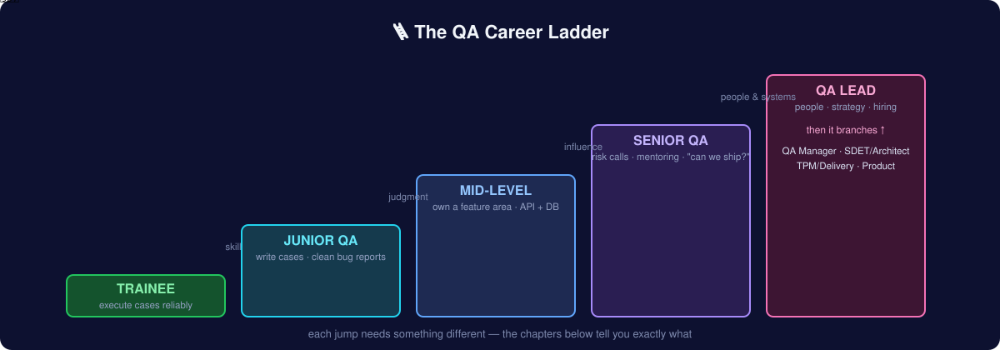
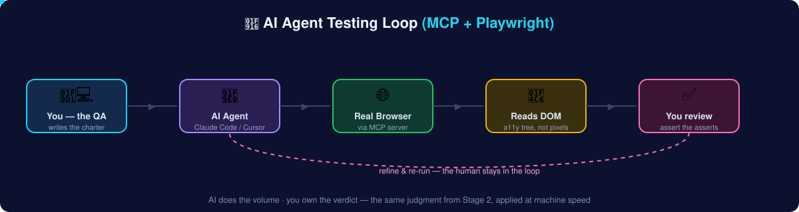

# 🎯 Capstone — Get Hired as a Sr. QA (the Modern Ladder)

> **Goal:** the single page that ties the whole roadmap together into one climb — from "I've never tested" to a **Senior QA / SDET** offer, using the modern **Manual + Automation + AI + MCP** stack. Every rung says exactly what to **learn**, what to **build**, and how to **prove** it. Do the rungs in order; don't skip. This is the ladder I climbed and the one I hire against.



## How to use this page

Each rung = **Learn → Build → Prove.** *Learn* links the chapter. *Build* is the thing you make. *Prove* is the public artifact that goes in your portfolio (a repo, a report, a collection). By the last rung you'll have **6–8 real artifacts** — that portfolio is what actually gets the Sr. QA offer, not a certificate.

> 🎓 Want this as guided video + a certificate? Every rung maps to a course on **[AZADEMY](https://azademy.vercel.app/)** (QA Automation · AI · Playwright · Python · Freelancing). The roadmap is the free textbook; the academy is the classroom.

---

## 🟢 Rung 1 — Think like a tester (Manual foundations)
- **Learn:** [Foundations](01-foundations.md) · [Test Design Techniques](02-test-design-techniques.md) · [Test Artifacts](03-test-artifacts.md)
- **Build:** a test plan, 25–40 test cases (naming the techniques: EP, BVA, decision tables), and 5 polished bug reports for [SauceDemo](https://www.saucedemo.com/).
- **Prove:** a public "manual-qa-portfolio" repo. 🏅 *Artifact #1.*

## 🟢 Rung 2 — Cover the whole surface (Testing types & process)
- **Learn:** [Types of Testing](04-types-of-testing.md) · [QA in Agile Teams](05-agile-and-process.md) · [The QA Toolbox](06-tools.md)
- **Build:** run a full risk-based cycle on [Automation Exercise](https://automationexercise.com/) — functional, cross-browser, negative — with a one-page test summary and a go/no-go call.
- **Prove:** the test summary report + a DevTools/HAR-backed bug. 🏅 *Artifact #2.*

## 🟡 Rung 3 — Go under the UI (API + data)
- **Learn:** [API Testing Deep Dive](13-api-testing-deep-dive.md)
- **Build:** a Postman collection against [restful-booker](https://restful-booker.herokuapp.com/apidoc/index.html) — CRUD + auth + negatives, all four assertion layers — runnable via Newman. Add 5 SQL checks that prove UI ↔ database agreement.
- **Prove:** the collection repo + a README of the bugs found. 🏅 *Artifact #3.* **This rung alone separates you from most manual-only testers.**

## 🟡 Rung 4 — Automate (the pyramid, done right)
- **Learn:** [Path to Automation](09-path-to-automation.md) · [Automation Deep Dive](15-automation-deep-dive.md)
- **Build:** a Playwright + TypeScript suite (Page Object Model, data-driven) covering 8–10 SauceDemo regression cases, **running in GitHub Actions on every push**, with the HTML report uploaded.
- **Prove:** a repo with a green CI badge. 🏅 *Artifact #4.* "My tests block merges on failure" is a Sr.-level sentence.

## 🔴 Rung 5 — Break it at scale (Performance + Security)
- **Learn:** [Performance Testing](16-performance-testing.md) · [Security Testing](14-security-testing.md)
- **Build:** a k6 load + spike test against [test.k6.io](https://test.k6.io/) with pass/fail thresholds and a percentile report; **and** find one Broken Access Control + one XSS on a local [OWASP Juice Shop](https://owasp.org/www-project-juice-shop/), written up ethically.
- **Prove:** a k6 report + two security bug reports. 🏅 *Artifacts #5–6.*

## 🔴 Rung 6 — Work with AI + MCP (the 2026 differentiator)
- **Learn:** [AI × QA](12-ai-for-qa.md)
- **Build:** use AI on real QA tasks (test-case generation, bug-report cleanup, log analysis — *verifying every output*), drive a browser with an **MCP + Playwright agent** (setup below), and build one **eval** for an AI feature with promptfoo.
- **Prove:** a write-up: what the agent caught vs missed, which generated assertions you kept, and your eval results. 🏅 *Artifact #7.* **Almost no candidate has this — it's your edge.**

## 🔴 Rung 7 — Lead & communicate (what makes it "Senior")
- **Learn:** [Soft Skills](10-soft-skills.md) · [Career Journey](07-career-journey.md) · [Interview Preparation](08-interview-prep.md)
- **Build:** a risk-based test strategy doc, a mentoring/README that teaches your framework, and prepared STAR interview stories.
- **Prove:** the strategy doc + polished LinkedIn/GitHub presence. 🏅 *Artifact #8.*

---

## 🤖 How AI + Automation + MCP actually work together

This is the modern Sr. QA daily loop — the thing interviewers now ask about. **AI does the volume; you own the verdict.**



1. **You set intent** — a charter: *"Explore checkout with expired cards and coupon stacking; report anything broken."*
2. **An MCP-connected AI agent** (Claude Code / Cursor) drives a **real browser** via the Playwright MCP server — clicking, typing, reading the accessibility tree (not screenshots).
3. **The agent explores + drafts tests** — it walks the app like a tireless junior and emits candidate Playwright specs.
4. **You review — the actual QA job** — you check the assertions assert the *right* things (AI loves asserting "page loaded" and calling it coverage). You keep the good, cut the noise.
5. **CI runs it** — the suite lands in GitHub Actions; Playwright's healer proposes fixes when locators drift; you approve.
6. **Evals guard AI features** — if the product has LLM features, an eval set scores every prompt/model change (relevance, accuracy, safety) the way regression guards code.

**The mindset:** everything in Rungs 1–5 matters *more* in this loop, because judgment is the scarce skill. AI amplifies a good tester and exposes a weak one.

### MCP + Playwright — step-by-step setup (5 minutes)

```bash
# 1. Add the official Playwright MCP server to your AI client (Claude Code shown)
claude mcp add playwright -- npx @playwright/mcp@latest

# 2. Confirm it's connected
claude mcp list
```

Then just ask your agent, in plain English:

> *"Open https://www.saucedemo.com, log in as standard_user, add a backpack to the cart, check out, and tell me anything that looks broken. Then generate a Playwright test for the happy path."*

The agent opens a real browser, does it, reports findings, and writes a spec. **You** review the spec, harden the assertions, and commit it. That's the loop. (Full detail, auth/Shadow-DOM gotchas, and the tool landscape: [AI × QA](12-ai-for-qa.md#3-mcp--playwright--ai-agents-driving-real-browsers).)

---

## ✅ The Sr. QA readiness checklist

You're ready to interview for Senior QA / SDET when you can honestly tick most of these:

**Craft**
- [ ] Design a minimal, high-coverage test suite from a vague requirement (EP/BVA/decision tables/state)
- [ ] Write a bug report a dev reproduces in one read
- [ ] Make a go/no-go call with a risk table and defend it

**Technical**
- [ ] Test an API end-to-end (status/body/headers/side-effects) and cross-check with SQL
- [ ] Build & maintain a Playwright/Selenium suite with POM, running in CI
- [ ] Run a load test with percentile thresholds and read the results
- [ ] Find the common OWASP bugs (IDOR, XSS) and escalate responsibly

**Modern / AI**
- [ ] Use AI to accelerate QA tasks *and* judge its output critically
- [ ] Drive a browser with an MCP + Playwright agent and review generated tests
- [ ] Explain how you'd test an AI/LLM feature (evals, hallucination, prompt-injection)

**Leadership**
- [ ] Set QA strategy and release gates; track escape rate & flake rate
- [ ] Communicate risk to non-QA stakeholders without blame
- [ ] Mentor a junior / improve a process with evidence

**Proof**
- [ ] A public portfolio with 6–8 real artifacts (the rungs above)

---

## 🗓️ The 6-month plan (evenings & weekends)

| Month | Rungs | Outcome |
|---|---|---|
| 1 | 1–2 | Manual portfolio + full test cycle |
| 2 | 3 | API collection + SQL checks |
| 3 | 4 | Playwright suite green in CI |
| 4 | 5 | k6 report + security findings |
| 5 | 6 | AI/MCP workflow + one eval |
| 6 | 7 | Strategy doc, interview prep, apply |

Move faster if you already have some rungs. The order matters more than the speed.

---

> **The bottom line:** a certificate says you *attended*; this portfolio says you can *do the job*. Climb the rungs, build the artifacts, and you won't be asking for a Sr. QA role — you'll be choosing between offers.

🎓 **Do it with structure, video and a certificate → [AZADEMY](https://azademy.vercel.app/).**
📬 Stuck or want a portfolio review? [azantor.xyz](https://azantor.xyz) · [open an issue](https://github.com/azaworld/qa-roadmap/issues).

← Back to [the roadmap](README.md)
