# Stage 16 — AI-Powered QA: Become the 100× Tester (the module)

> **Goal:** turn AI from a novelty into your daily force-multiplier — know exactly *what to learn before you implement it*, *what to automate*, *how to stack tactics into ~100× throughput*, and *how to do it safely*. [Stage 11: AI × QA](12-ai-for-qa.md) is the hands-on MCP + Playwright + evals primer; **this module is the strategy, the prerequisites, and the adoption playbook.** Field notes from running AZAI Labs (*build with agents, not headcount*).

## 1. What "100×" actually means (honest math)

You will not run one magic tool that's 100× faster. You'll apply **many 3–10× tactics across your day**, and they *compound*: faster test design × instant test data × agent-driven exploration × generated test code × instant log triage. Ten activities each 2–10× faster is a different *job*, not a faster version of the old one. **AI removes the toil; your judgment becomes the scarce, valuable part.**

The mental model:
> Old QA = do the work + judge the work.  ·  AI QA = *direct* the work + judge the work at 10× the volume.

## 2. 🧠 Before you implement AI — what QA MUST know first

Skipping this is why most AI-QA efforts produce confident garbage. AI amplifies whoever's driving — a strong tester gets 100×, a weak one 100×'s their mistakes. **Master these before you automate anything with AI:**

| Prerequisite | Why it's non-negotiable | Where to learn |
|---|---|---|
| **Test design & risk thinking** | You must *judge* AI output — spot the missing boundary, the weak assertion, the wrong oracle. AI proposes; you decide | [Stage 1](02-test-design-techniques.md), [Stage 4](05-agile-and-process.md) |
| **What "correct" looks like (oracles)** | AI can't tell you the *right* answer for your product — you supply the oracle | [Stage 0](01-foundations.md) |
| **Basic programming + CLI + Git** | To run agents, read generated code, and commit it | [Stage 14](15-automation-deep-dive.md) |
| **How LLMs work (high level)** | Tokens, context windows, **non-determinism**, **hallucination**, temperature — so you know when to trust output and when not to | [Stage 11](12-ai-for-qa.md) |
| **Prompting fundamentals** | Role + context + constraints + examples = usable output. Vague prompt = vague result | §7 below |
| **The stack: MCP, an AI client, Playwright, an eval tool** | The actual tools you'll wire together | §5 below |
| **Data & security hygiene** | **Never paste secrets, credentials, customer PII, or proprietary code into a prompt** unless the tool is approved for it. Know your company's AI policy | [Stage 13](14-security-testing.md) |
| **Verification discipline** | *AI drafts, you decide.* Every AI artifact is a draft until you've verified it | everywhere |

### ✅ Readiness check — you're ready to implement AI when you can:
- [ ] Design a strong test suite from a vague requirement *without* AI
- [ ] Look at an AI-generated test and say precisely why an assertion is weak
- [ ] Run a script from the terminal and commit it with Git
- [ ] Explain hallucination and non-determinism in one sentence each
- [ ] Write a prompt with role, context, constraints, and an example
- [ ] State what data you must **never** put into a prompt

## 3. 🗺️ What AI can automate across the QA lifecycle

| QA activity | AI leverage | Tool | Your (human) role |
|---|---|---|---|
| Requirement/AC review | Flag ambiguity & gaps before coding | any LLM | Decide what's actually a gap |
| Test-case design | Generate EP/BVA/negative/edge cases | LLM + your prompt | Prune, prioritize, add domain risk |
| Test data | Unicode/RTL/boundary/malformed sets instantly | LLM | Confirm realism & privacy |
| Exploratory testing | Agent walks the app via [MCP](12-ai-for-qa.md#3-mcp--playwright--ai-agents-driving-real-browsers) | Playwright MCP + Claude Code/Cursor | Set the charter; judge findings |
| Test **code** generation | Draft Playwright/API specs from a description or recording | codegen + agent | **Review assertions** (the job) |
| Self-healing automation | Auto-fix drifted locators | Playwright healer, Testim, Mabl | Approve/reject the fix |
| Bug reports | Turn messy notes into clean reports | LLM + your [template](templates/bug-report-template.md) | Verify repro & evidence |
| Log / trace / HAR triage | Explain stack traces, find root cause fast | LLM | Confirm the hypothesis |
| Regression selection | "Given this diff, what's most at risk?" | LLM | Final risk call |
| Visual testing | AI diffing that ignores noise | Applitools, Percy | Approve intended changes |
| Docs & test summaries | Draft summaries, coverage notes | LLM | Fact-check |
| **Testing AI features** | Build eval sets, LLM-as-judge, red-team | promptfoo, DeepEval | Own the quality bar |

## 4. ⚡ The 100× speed playbook (stack these)

Each tactic below, with how to trigger it. Do them daily until they're reflexes.

1. **Instant test design (×5).** Paste the story + your draft cases: *"Act as a senior QA. What conditions am I missing — boundaries, states, concurrency, failure modes? Return a table."* Keep what survives your judgment.
2. **Instant test data (×10).** *"Generate 40 signup records covering locale, length, format, unicode/RTL, and injection edge cases, as CSV."*
3. **Agent-driven exploration (×8).** [MCP](12-ai-for-qa.md#3-mcp--playwright--ai-agents-driving-real-browsers): *"Open staging, explore checkout with expired cards and stacked coupons, report anything broken."* Review its findings.
4. **Generated test code (×6).** `npx playwright codegen`, or ask the agent to emit a spec — then **rewrite assertions** to check the right things.
5. **Log/trace triage (×4).** Paste the failure: *"Likely root cause? What should I check next?"*
6. **One-read bug reports (×3).** Notes + template → clean report; you verify repro and attach evidence.
7. **Requirement review (×5).** *"List every ambiguous or untestable statement in this user story."*
8. **Regression targeting.** Feed the changelog/diff: *"Which of these 40 cases are most at risk from this change?"*
9. **Docs & summaries.** Draft the test summary report; you fact-check and sign the recommendation.
10. **Evals for AI features.** Stand up a promptfoo set so every prompt/model change is scored automatically.

> **The compounding rule:** don't chase one giant automation. Win 30 minutes here, an hour there, all day — that's the 100×.

## 5. 🧰 The modern AI-QA stack (2026)

| Layer | Tools |
|---|---|
| AI client (the cockpit) | [Claude Code](https://www.claude.com/product/claude-code) · [Cursor](https://cursor.com/) · Claude/ChatGPT web |
| Browser control for agents | [Playwright MCP](https://github.com/microsoft/playwright-mcp) + [Model Context Protocol](https://modelcontextprotocol.io/) |
| Automation engine | [Playwright](https://playwright.dev/) (+ its planner/generator/**healer** agents) |
| Self-healing / low-code AI | Testim · Mabl · Functionize |
| Visual AI | [Applitools](https://applitools.com/) · Percy |
| LLM evals (testing AI) | [promptfoo](https://promptfoo.dev/) · [DeepEval](https://github.com/confident-ai/deepeval) · [Langfuse](https://langfuse.com/) · [OpenAI Evals](https://github.com/openai/evals) |
| AI security | [OWASP Top 10 for LLM Apps](https://owasp.org/www-project-top-10-for-large-language-model-applications/) |

**Master depth, not breadth:** one agentic workflow (MCP + Playwright) + one eval tool (promptfoo) beats ten tools used shallowly.

## 6. 🪜 The adoption ladder (crawl → fly)

| Rung | You can… | Prove it |
|---|---|---|
| **Crawl** | Use AI daily for test design, data, and bug reports — verifying every output | A week of AI-assisted artifacts |
| **Walk** | Run an MCP agent to explore a staging app and summarize findings | An agent exploration write-up |
| **Run** | Agent-generate a test suite, harden the assertions, run it in CI | A green AI-assisted pipeline |
| **Fly** | Build eval pipelines for AI features + design an AI-QA workflow your team adopts | A team playbook + eval dashboard |

## 7. 📝 Prompt patterns for QA (copy-paste library)

- **Role + constraints:** *"You are a senior QA engineer. Given this requirement, list the test conditions I'm missing. Focus on boundaries, states, concurrency, and failure modes. Output a table; no prose."*
- **Few-shot (teach your style):** paste 2 of your best bug reports, then *"Write the next one in exactly this format."*
- **Self-critique (catch weak output):** *"Here are 10 tests you generated. Now act as a skeptical reviewer and flag which assertions are weak or only check 'it loaded'."*
- **Grounded (reduce hallucination):** *"Using ONLY the API spec below, list every endpoint's negative test cases. If the spec doesn't say, write 'UNSPECIFIED'."*
- **Explain-then-act:** *"First explain the likely root cause of this trace, then propose the next 3 checks."*

## 8. 🛡️ Guardrails & pitfalls (read before you scale)

- **Hallucinated tests / weak assertions** — AI loves asserting "page loaded." Review every assertion; that review *is* the QA job.
- **Over-trust** — never sign off a release on unverified AI output. AI drafts, you decide.
- **Non-determinism** — the same prompt gives different output; pin versions, keep humans in the loop, and eval on every change.
- **Security & privacy** — no secrets/PII/proprietary code in prompts unless the tool is sanctioned. Follow your company's AI policy.
- **Agents in production** — staging only, supervised, least-privilege. Auth reuse (storage state), not re-login loops.
- **Flaky agent runs** — treat like a new hire's first week: watched, then trusted.
- **Governance** — log what AI generated, who reviewed it, and keep the audit trail.

## 9. 📊 Prove the speed-up (metrics)

If you can't measure it, you can't defend it (or get promoted for it):

| Metric | What it shows |
|---|---|
| **Cycle time** (idea → tested) | The headline speed-up |
| **Time-to-first-test** for a new feature | AI's biggest early win |
| **Coverage** (cases/paths per sprint) | More surface, same headcount |
| **Defect escape rate** | Speed didn't cost quality (the honest one) |
| **Automation authored per week** | Agent leverage, real |
| **Flake rate** | Guardrail on agent-generated tests |

## 10. 🗓️ 30 / 60 / 90-day adoption plan

- **Days 1–30 (Crawl):** AI on every test-design, data, and bug-report task. Build the prompt habit + your prompt library.
- **Days 31–60 (Walk→Run):** set up Playwright MCP; run agent explorations; agent-generate a small suite, harden it, put it in CI.
- **Days 61–90 (Fly):** build one promptfoo eval for an AI feature; write your team's AI-QA playbook; start measuring cycle time & escape rate.

## 11. Where this takes your career

AI-fluent QA is the scarcest, best-paid corner of the field — companies find evaluators harder to hire than builders, and QA people are natural evaluators. Roles: **AI QA Engineer · AI Evals Engineer · LLM Auditor · Agentic Automation Engineer** (see [Stage 11 §6](12-ai-for-qa.md) and the [Capstone](18-capstone-sr-qa.md)).

## ✅ Exercise

1. Run the **readiness check** in §2 — honestly. Fix any gap before going further.
2. Pick **three** tactics from §4 and use them on real work today; note the time saved.
3. Stand up Playwright MCP and do one agent exploration; review its assertions and keep only the good ones.
4. Build a 5-case promptfoo eval for any public chatbot feature.

> 🎓 Want this as a guided, hands-on course with feedback? It's a track on **[AZADEMY](https://azademy.vercel.app/)**.

**Next →** the [Capstone: Get Hired as a Sr. QA](18-capstone-sr-qa.md) · or the hands-on [Stage 11: AI × QA](12-ai-for-qa.md)
