# 🗺️ Scenario Flowcharts — Visualize & Teach Every QA Flow

> **Goal:** one animated, interactive flowchart for every core QA scenario — so you can *see* the flow, *remember* it, and *teach* it on camera without slides. The edges animate (flow), the diagrams recolor with the light/dark toggle, and many nodes are **clickable** — they open the real demo site to practice on. Each chart has a **🖥️ Teach with** (live site) and a **📖 Learn** (chapter) link.

> 💡 Every flowchart here is written in plain Mermaid text in the page source — you (or any contributor) can drop a ` ```mermaid ` block into *any* chapter and it renders the same way.

---

## 1. The tester's mindset — "how could this break?"
<div class="teachbox">🖥️ <b>Teach with:</b> <a href="https://www.saucedemo.com/" target="_blank" rel="noopener">SauceDemo</a> (login <code>problem_user</code>) · 📖 <b>Learn:</b> <a href="01-foundations.html">Stage 0</a></div>

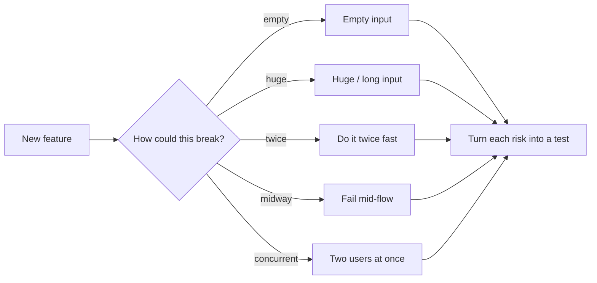

## 2. The Software Testing Life Cycle (STLC)
<div class="teachbox">📖 <b>Learn:</b> <a href="01-foundations.html">Stage 0</a></div>

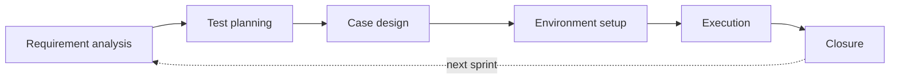

## 3. Choosing a test-design technique
<div class="teachbox">🖥️ <b>Teach with:</b> <a href="https://demoqa.com/automation-practice-form" target="_blank" rel="noopener">DemoQA form</a> · 📖 <b>Learn:</b> <a href="02-test-design-techniques.html">Stage 1</a></div>

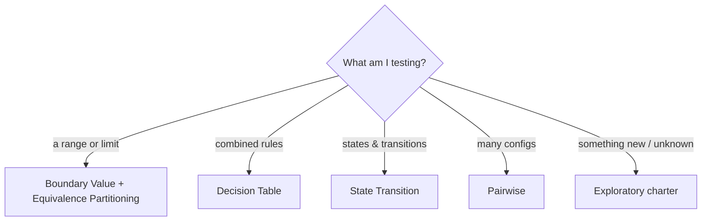

## 4. The defect lifecycle
<div class="teachbox">🖥️ <b>Teach with:</b> <a href="https://github.com/azaworld/qa-roadmap/issues" target="_blank" rel="noopener">GitHub Issues</a> · 📖 <b>Learn:</b> <a href="05-agile-and-process.html">Stage 4</a></div>

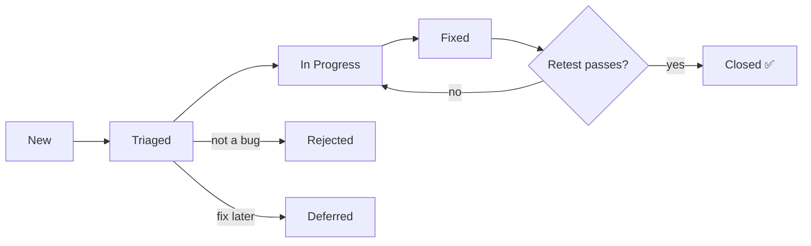

## 5. Severity vs Priority (the triage decision)
<div class="teachbox">📖 <b>Learn:</b> <a href="03-test-artifacts.html">Stage 2</a> · <a href="20-cheatsheets.html">Cheatsheet</a></div>

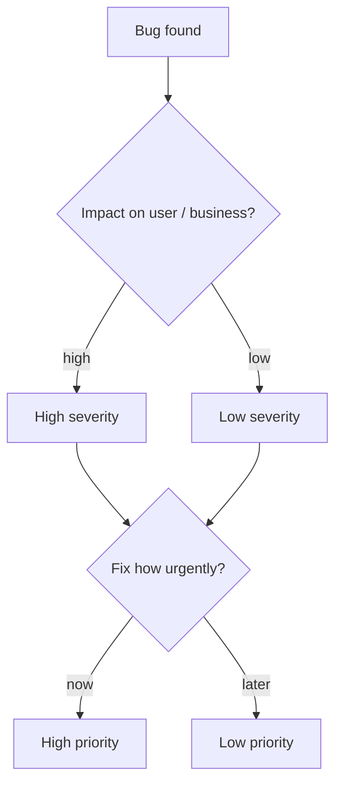

## 6. Writing a bug report that gets fixed
<div class="teachbox">🖥️ <b>Teach with:</b> <a href="https://www.saucedemo.com/" target="_blank" rel="noopener">SauceDemo</a> + DevTools · 📖 <b>Learn:</b> <a href="03-test-artifacts.html">Stage 2</a></div>

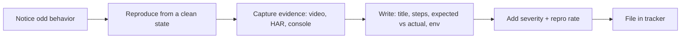

## 7. API test flow (four assertion layers)
<div class="teachbox">🖥️ <b>Teach with:</b> <a href="https://petstore.swagger.io/" target="_blank" rel="noopener">Swagger Petstore</a> (click the node!) · 📖 <b>Learn:</b> <a href="13-api-testing-deep-dive.html">Stage 12</a></div>

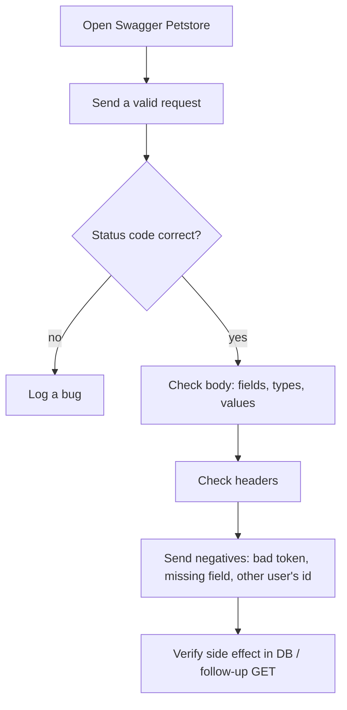

## 8. Should I automate this test?
<div class="teachbox">📖 <b>Learn:</b> <a href="09-path-to-automation.html">Stage 8</a> · <a href="15-automation-deep-dive.html">Stage 14</a></div>

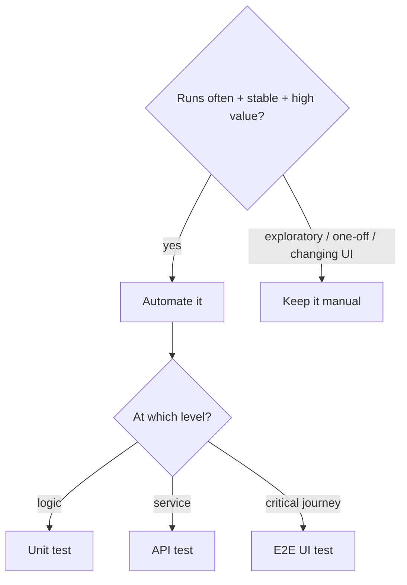

## 9. The CI/CD test pipeline
<div class="teachbox">🖥️ <b>Teach with:</b> <a href="https://github.com/azaworld/qa-roadmap/actions" target="_blank" rel="noopener">GitHub Actions</a> · 📖 <b>Learn:</b> <a href="15-automation-deep-dive.html">Stage 14</a></div>

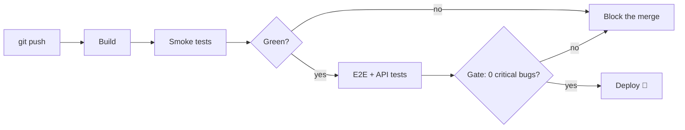

## 10. Choosing a performance test
<div class="teachbox">🖥️ <b>Teach with:</b> <a href="https://test.k6.io/" target="_blank" rel="noopener">test.k6.io</a> · 📖 <b>Learn:</b> <a href="16-performance-testing.html">Stage 15</a></div>

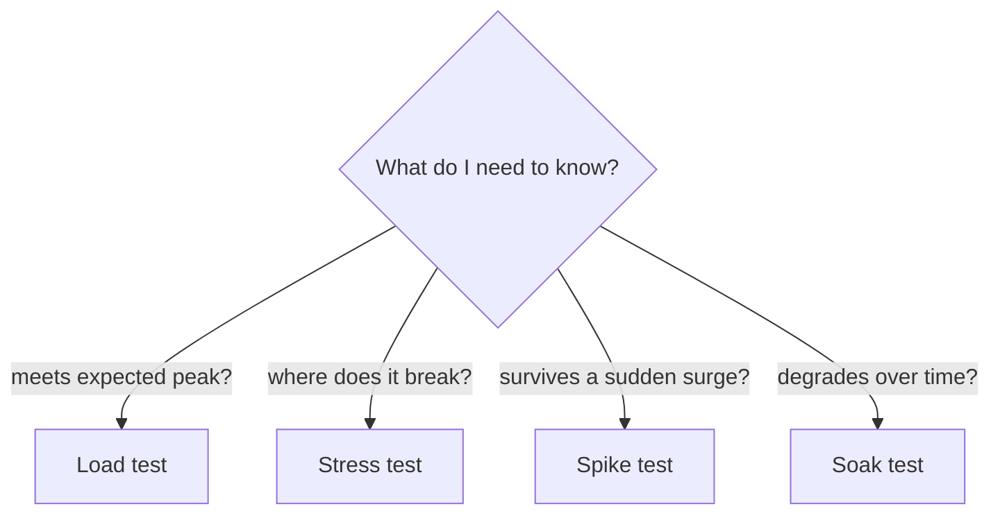

## 11. Security — the IDOR test (Broken Access Control)
<div class="teachbox">🖥️ <b>Teach with:</b> <a href="https://owasp.org/www-project-juice-shop/" target="_blank" rel="noopener">OWASP Juice Shop</a> · 📖 <b>Learn:</b> <a href="14-security-testing.html">Stage 13</a></div>

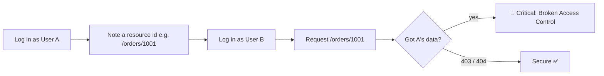

## 12. AI + MCP agent testing loop
<div class="teachbox">🖥️ <b>Teach with:</b> <a href="https://www.claude.com/product/claude-code" target="_blank" rel="noopener">Claude Code</a> + <a href="https://github.com/microsoft/playwright-mcp" target="_blank" rel="noopener">Playwright MCP</a> · 📖 <b>Learn:</b> <a href="12-ai-for-qa.html">Stage 11</a></div>

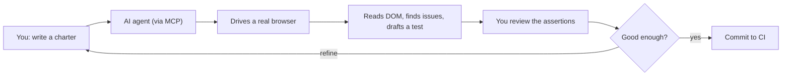

## 13. A structured exploratory session
<div class="teachbox">🖥️ <b>Teach with:</b> <a href="https://the-internet.herokuapp.com/" target="_blank" rel="noopener">the-internet</a> · 📖 <b>Learn:</b> <a href="02-test-design-techniques.html">Stage 1</a></div>

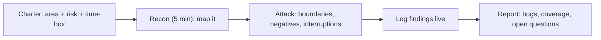

## 14. The interview process, end to end
<div class="teachbox">📖 <b>Learn:</b> <a href="08-interview-prep.html">Stage 7</a> · <a href="19-interview-bank.html">Interview Bank</a></div>

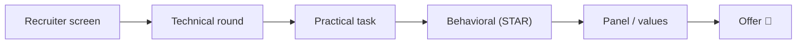

---

> 🎓 Screen-share this page while teaching — walk a flowchart, then click through to its demo site and *do* it live. Full per-topic teaching scripts are in the [🎬 Teaching Kit](21-teaching-kit.html). Publish your videos on [AZADEMY](https://azademy.vercel.app/).

← Back to [the roadmap](README.md) · **See also:** [Teaching Kit](21-teaching-kit.html) · [Cheatsheets](20-cheatsheets.html)
