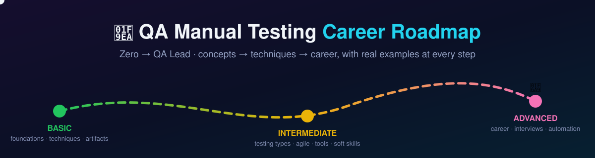

# 🧪 QA Roadmap — Manual · Automation · AI

**From zero to QA Lead — the complete QA curriculum, in the order you need to learn it, with real-world examples at every step.** Covers **Manual, Automation, AI × QA, API, Performance & Security** — choose your path and level up.

🌐 **Play it as a gamified website:** [azaworld.github.io/qa-roadmap](https://azaworld.github.io/qa-roadmap/) — pick a track, mark lessons complete, earn XP, levels & badges (saved in your browser), and practice on real apps in [The Playground](17-playground.md).

📊 **See everything at a glance:** the [QA Learning Dashboard](https://azaworld.github.io/qa-roadmap/dashboard.html) maps the whole curriculum, shows your progress ring & level, and links straight to every lesson and resource.

🗺️ **Visualize & teach:** [Scenario Flowcharts](https://azaworld.github.io/qa-roadmap/26-flowcharts.html) — animated, interactive flowcharts for every core QA flow, each linked to a live demo site to teach from.

  
  
  
  

Most QA guides teach you *definitions*. This one teaches you the **job**: how to think about testing, how to write artifacts that engineers respect, how to run QA inside a real agile team, and how to grow from your first test case to leading a QA team — because I've walked every step of it (Mastercard, NYC healthcare, Bangladesh's largest telecom, global e-commerce).

---

## 🗺️ The Journey — Start Here

Follow the stages in order — **🟢 Basic → 🟡 Intermediate → 🔴 Advanced**. Each stage links to a full chapter with worked examples, an exercise, and sources to go deeper.

### 🟢 Basic — the foundation everything stands on

| Stage | Chapter | What you'll be able to do after it |
|:---:|---|---|
| **0** | [Foundations](01-foundations.md) | Explain what QA actually is, how software gets built (SDLC), and where testing fits (STLC) |
| **1** | [Test Design Techniques](02-test-design-techniques.md) | Design *smart* test cases that find bugs with the fewest tests — EP, BVA, decision tables, state transitions |
| **2** | [Test Artifacts](03-test-artifacts.md) | Write test plans, test cases, and bug reports that developers act on immediately |

### 🟡 Intermediate — working like a professional

| Stage | Chapter | What you'll be able to do after it |
|:---:|---|---|
| **3** | [Types of Testing](04-types-of-testing.md) | Know every kind of testing — functional, non-functional, API, mobile, data — when to use each, and how to run it manually |
| **4** | [QA in Agile Teams](05-agile-and-process.md) | Work a real sprint: defect lifecycle, severity vs priority, release gates, QA metrics, risk-based testing |
| **5** | [The QA Toolbox](06-tools.md) | Jira, TestRail/QASE, Postman, browser DevTools, SQL, proxy tools — the daily drivers |
| **9** | [Soft Skills](10-soft-skills.md) | Communicate, negotiate, and report like the tester everyone wants on their team |
| **+** | [Tech Foundations](24-tech-foundations.md) | Exactly how much **coding, SQL, algorithms & AI** you need — scoped by role, so you learn what matters and skip what doesn't |

### 🔴 Advanced — growing beyond the role

| Stage | Chapter | What you'll be able to do after it |
|:---:|---|---|
| **6** | [Career Journey](07-career-journey.md) | Map yourself Junior → Mid → Senior → Lead, build a portfolio, get hired |
| **7** | [Interview Preparation](08-interview-prep.md) | Answer the questions that actually get asked — with model answers |
| **CV** | [QA Resume & CV](27-resume-cv.md) | Write an ATS-friendly Junior, Mid, Senior QA or SDET resume with copy-ready templates and measurable bullets |
| **8** | [Path to Automation](09-path-to-automation.md) | Know when and how to add automation without abandoning your manual craft |
| **10** | [Sources & Further Learning](11-resources.md) | The curated library: books, courses, practice sites, podcasts — with a per-stage reading map |

### 🚀 Specialist Tracks — go deep where the market pays

| Stage | Chapter | What you'll be able to do after it |
|:---:|---|---|
| **11** | [AI × QA (MCP + Playwright)](12-ai-for-qa.md) | Use AI on every QA task, drive browsers with AI agents via MCP, test AI systems (evals), and steer your career into AI QA |
| **12** | [API Testing Deep Dive](13-api-testing-deep-dive.md) | Own API quality end-to-end: HTTP, negative design, auth, contract testing, GraphQL, automation-ready Postman/Newman |
| **13** | [Security Testing](14-security-testing.md) | Find the OWASP Top 10 bugs functional testing misses — IDOR, XSS, injection — with ZAP/Burp, ethically |
| **14** | [Automation Deep Dive](15-automation-deep-dive.md) | Build real, maintainable UI + API automation: Playwright/Selenium, the pyramid, POM, locators & waits, data-driven, CI/CD, reporting |
| **15** | [Performance Testing](16-performance-testing.md) | Load, stress, spike & soak testing with k6/JMeter — percentile metrics, methodology, bottleneck analysis, CI gates |
| **16** | [AI-Powered QA (100×)](22-ai-powered-qa.md) | Become the 100× tester: what to know *before* AI, what to automate, the speed playbook, adoption ladder, prompt library, guardrails & metrics |

### 🎯 The Capstone — put it all together

> **[Get Hired as a Sr. QA — the Modern Ladder](18-capstone-sr-qa.md)** ties the whole roadmap into one climb: rung-by-rung **Learn → Build → Prove**, the modern **AI + Automation + MCP** workflow (with step-by-step MCP setup), a Sr. QA readiness checklist, and a 6-month plan. Start here if you want the end-to-end path to the job.

**Templates you can copy today:** [Test Plan](templates/test-plan-template.md) · [Test Case](templates/test-case-template.md) · [Bug Report](templates/bug-report-template.md) · [QA Resume / CV](templates/qa-resume-cv-template.md)

**Worked examples:** [E-commerce checkout test cases](examples/ecommerce-checkout-test-cases.md) · [Real bug report](examples/sample-bug-report.md)

**📚 Career & interview prep:** [QA Resume & CV — Junior → SDET](27-resume-cv.md) · [Interview Bank (Top 100+ Q&A)](19-interview-bank.md) · [🤖 AI Tools Directory (auto-updated)](23-ai-tools.md) · [Cheatsheets](20-cheatsheets.md) · [🎬 Teaching Kit — live demo sites](21-teaching-kit.md) (screen-share these to teach any section, no slides)

**🇧🇩 Job hunting in Bangladesh?** Browse the searchable [directory of 235+ BD software companies](25-bd-companies.md) — filter by tech stack or location to find where to apply.

**🎓 Guided courses:** prefer video + a certificate? Take these as courses on **[AZADEMY](https://azademy.vercel.app/)** — the roadmap is the free textbook, the academy is the classroom.

---

## 🎯 Who this is for

- **Complete beginners** who want a realistic path into tech without writing code first
- **Junior QA engineers** who know the definitions but want to work like a senior
- **Developers & PMs** who want to understand what great QA looks like
- **Manual testers** deciding when (and whether) to move into automation

---

## 👤 Why listen to me — what I've actually done

I'm **Arifuzzaman "Antor"** ([azantor.xyz](https://azantor.xyz)) — today Founder & CEO of [AZAI Labs](https://azailabs.dev), Co-Founder & CTO of Upward, Technical Project Manager at [Platformz](https://platformz.us), and Sr. SDET at Kintsugi. Before all that, I spent 6+ years as a QA engineer, climbing the exact ladder this roadmap describes: **Junior QA → QA Lead → SDET/TPM → founder.** This is the guide I wish I had on day one. The receipts:

- 💳 **Mastercard** — Sr. Automation & Reliability Engineer: chaos engineering on payment-critical systems
- 🏥 **Kinetik (NYC healthcare)** — QA Engineer I → **QA Lead**: owned quality for a NEMT platform (13M+ trips, $1.1B+ claims); shipped the iOS & Android apps
- 🛒 **Platformz / FUR4** — led a **30+ person** team; delivered a 12-month 3P EDI program in **~60 days** across Amazon, Walmart, Target, Chewy, eBay & Macy's
- 📱 **Grameenphone (MyGP)** — backend automation from zero for Bangladesh's largest mobile operator
- 🏛️ **Government / civic tech** — OpenCRVS (UN-backed civil registration), IPEMIS, Sothik (AI Bangla spell-checker, QA lead)
- ⭐ **Upwork Top Rated** — 23 jobs completed, every single one rated ★5.0

Every template in this repo is a cleaned-up version of an artifact I've used on real projects. **👉 [Read the full story & experience →](about.md)**

---

## 🚀 How to use this repo

1. **Read stages 0–2 first** — they're the foundation everything else stands on
2. **Do the exercises** at the end of each chapter (yes, actually do them)
3. **Copy the templates** into your own projects — make them yours
4. **Star ⭐ this repo** so you can come back as you progress

> 💬 Questions, feedback, or want to share your progress? Open an issue — I read them.

---

## 📜 License

MIT — learn from it, fork it, share it. Attribution appreciated.

  <a href="https://azantor.xyz"><b>azantor.xyz</b></a> · <a href="https://github.com/azaworld">@azaworld</a> · <i>Turns chaos into shipped products.</i>

